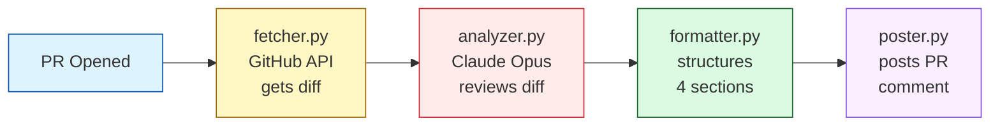

# pr-reviewer

AI-powered GitHub PR reviewer using Claude Opus. Drops into any repo in 2 steps.


## What it does

When a pull request is opened or updated, this action fetches the diff, sends it to Claude Opus
with an embedded code review and security checklist, and posts a structured review comment with
four sections: Bugs, Security, Code Quality, and Suggestions. The comment is updated in-place on
every new commit to the PR.

## Quick start

**Step 1:** Add `ANTHROPIC_API_KEY` to your repo secrets
(Settings → Secrets and variables → Actions → New repository secret).

**Step 2:** Add this file to `.github/workflows/pr-review.yml` in your repo:

    on: [pull_request]
    jobs:
      review:
        uses: Adir1123/pr-reviewer/.github/workflows/review.yml@v1
        secrets:
          ANTHROPIC_API_KEY: ${{ secrets.ANTHROPIC_API_KEY }}

## How it works



## Project structure

```
reviewer/
├── main.py       # orchestrates the pipeline
├── fetcher.py    # fetches PR diff from GitHub API
├── analyzer.py   # sends diff to Claude Opus
├── formatter.py  # parses response into 4 sections
├── poster.py     # posts or updates PR comment
└── prompts.py    # system prompt + user prompt builder
tests/            # pytest suite — all API calls mocked
action.yml        # composite action definition
.github/
└── workflows/
    ├── review.yml  # reusable workflow (what target repos call)
    └── test.yml    # CI: runs pytest on push
```

## Local development

```bash
git clone https://github.com/Adir1123/pr-reviewer
pip install -r requirements.txt
cp .env.example .env   # fill in your keys
pytest
```

| Variable | Description |
|---|---|
| `ANTHROPIC_API_KEY` | Your Anthropic API key |
| `GITHUB_TOKEN` | GitHub personal access token with `repo` scope |
| `PR_NUMBER` | PR number to review |
| `REPO` | Repository in `owner/repo` format |
| `PR_SHA` | Commit SHA of the PR head |

## License

MIT

## Test PR

This change is only for testing the PR reviewer.